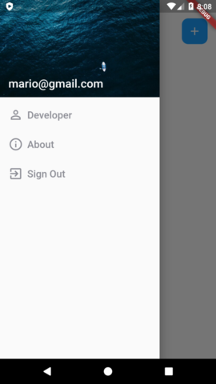
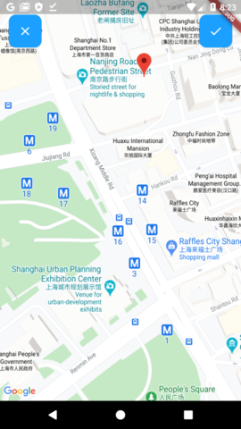
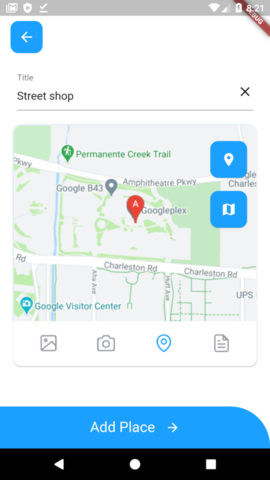
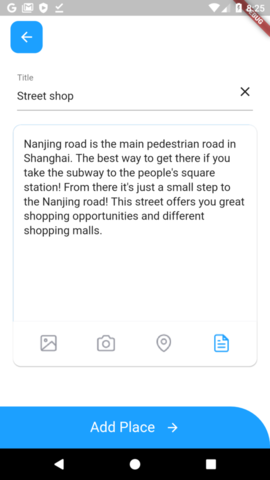
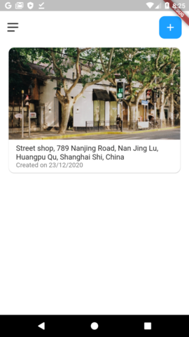
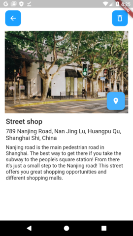
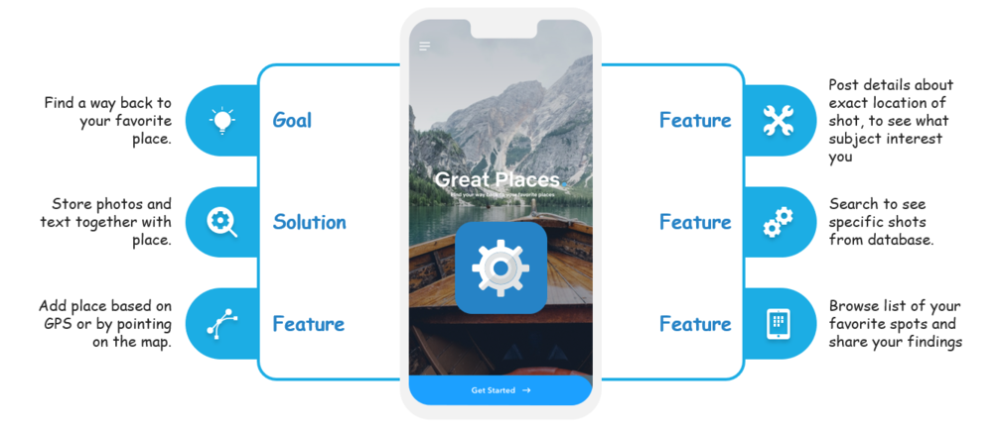

# Great Places - Photo App

A Mobile Dart/Flutter App built on Firestore. App allows you to use your camera to take a picture of where you are, add details and attach a GPS location to it, which will then provide you with an address as well. Store all your favorite places and exactly where you took that picture!










## Inspiration

This app is based on GREAT PLACES APP - Created by Academind by Maximilian Schwarzmüller (Learn Flutter and Dart to Build iOS and Android Apps 2020) [Great Places](https://github.com/PacktPublishing/Learn-Flutter-and-Dart-to-Build-iOS-and-Android-Apps/tree/master/Section%2013).

Front-end design of Onboarding Screen inspired by [@mkobuolys Onboarding Concept](https://github.com/mkobuolys/flutter-design-challenges/tree/master/Onboarding%20Concept/final)


## Features




## Technical Features

- Local storage usage for in-app photos using Paths and Path_Provider.
- Uses Cloud Firestore DB for relevant data taken.
- Uses FirebaseUI for authentication.
- Uses Native Camera feature to snap photos.
- Uses Google Maps for current location (Native GPS) and latitude/longitude of where the picture was taken.
- Accesses GoogleMaps for interactive mapping and marker pinning.
- Reverse geocoding used to provide address of where the photo was taken or where the marker was added.


## Plugins
These are the available plugins in this repository.

| Plugin | Pub | Points | Popularity | Likes |
|--------|-----|--------|------------|-------|
| cloud_firestore | [](https://pub.dev/packages/cloud_firestore) |  [](https://pub.dev/packages/firebase_auth/score) |  [](https://pub.dev/packages/cloud_firestore/score) | [](https://pub.dev/packages/cloud_firestore/score) |
| firebase_auth | [](https://pub.dev/packages/firebase_auth) |  [](https://pub.dev/packages/cloud_firestore/score) |  [](https://pub.dev/packages/firebase_auth/score) | [](https://pub.dev/packages/firebase_auth/score) |
| firebase_core | [](https://pub.dev/packages/firebase_core) |  [](https://pub.dev/packages/firebase_core/score) |  [](https://pub.dev/packages/firebase_core/score) | [](https://pub.dev/packages/firebase_core/score) |
| google_maps_flutter | [](https://pub.dev/packages/cloud_firestore) |  [](https://pub.dev/packages/google_maps_flutter/score) |  [](https://pub.dev/packages/cloud_firestore/score) | [](https://pub.dev/packages/google_maps_flutter/score) |
| image_picker | [](https://pub.dev/packages/image_picker) |  [](https://pub.dev/packages/image_picker/score) |  [](https://pub.dev/packages/image_picker/score) | [](https://pub.dev/packages/image_picker/score) |
| location | [](https://pub.dev/packages/location) |  [](https://pub.dev/packages/location/score) |  [](https://pub.dev/packages/location/score) | [](https://pub.dev/packages/location/score) |
| path_provider | [](https://pub.dev/packages/path_provider) |  [](https://pub.dev/packages/path_provider/score) |  [](https://pub.dev/packages/path_provider/score) | [](https://pub.dev/packages/path_provider/score) |


## Setup

You can follow these instructions to build the app and install it onto your device.


### Prerequisites

If you are new to Flutter, please first follow the [Flutter Setup](https://flutter.dev/setup/) guide.


### Building and installing the Flutter Design Patterns app

```
git clone git clone https://harpreet_k@bitbucket.org/harpreet_k/great_places_flutter.git
cd great_places_flutter
flutter run
```

The `flutter run` command both builds and installs the Flutter app to your device or emulator.


## Firestore

  * [Set up your Android app for Firestore][setup-android]
  * In the Authentication tab of the Firebase console go to the
    [Sign-in Method][auth-providers] page and enable 'Email/Password' and 'Anonymous'.
    * This app uses [FirebaseUI][firebaseui] for authentication.
  * Run the app on an Android emulator.


### Google Maps API

Before using/testing the application, you need a new API key. Follow the instructions at Maps SDK for Android — Get API Key. Once you have your API key, add it to your Flutter app in the application manifest (android/app/src/main/AndroidManifest.xml), as follows:

```
...
<manifest ...
  <application ...
    <meta-data android:name="com.google.android.geo.API_KEY"
               android:value="YOUR KEY HERE"/>
...
```